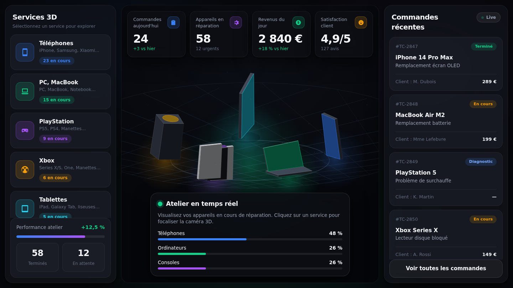
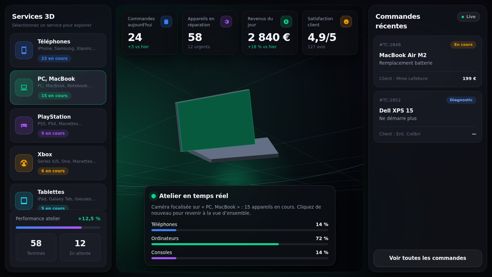

# Atelier 3D — poste de pilotage

Variante d'interface pour MS-MOBILE : fond sombre, cartes en verre, accents
néon et une scène 3D de l'atelier au centre.

`atelier-3d.html` s'ouvre directement dans un navigateur. Comme les fichiers de
boutique, il est **autonome** : aucune dépendance, aucun réseau, aucune
bibliothèque 3D. La scène est rendue par un petit moteur logiciel (≈ 200 lignes)
sur un canvas 2D : projection perspective, tri des faces par profondeur,
éclairage plat, brouillard, halos et ombres portées.

## Ce qu'on peut faire

- **Cliquer un service** à gauche : la caméra rejoint l'appareil correspondant,
  les autres sortent de la scène, les commandes et les barres se filtrent.
  Un second clic revient à la vue d'ensemble.
- **Faire tourner la scène** en glissant, **zoomer** à la molette.
- La souris décale légèrement la caméra : la scène réagit sans qu'on la touche.

## Structure

| Zone | Contenu |
|---|---|
| Colonne de gauche | Sélecteur de services avec compteurs, performance atelier |
| Centre | Scène 3D, compteurs flottants, panneau « Atelier en temps réel » |
| Colonne de droite | Commandes récentes avec statuts, accès à la liste complète |

Sous 860 px, les cartes flottantes redeviennent des blocs empilés et la scène
garde une hauteur utile : rien ne la recouvre.

## Données

Les données sont pour l'instant des constantes en haut du script (`SERVICES`,
`KPIS`, `ORDERS`), volontairement aux mêmes formes que le modèle de MS-MOBILE.
Le branchement sur l'état réel se fait en remplaçant ces trois constantes par
des lectures de `MS.store.state`.

## Vérification

`tests/e2e/07-design.spec.mjs` contrôle que la scène se peint vraiment, qu'aucune
ressource n'est chargée depuis le réseau, que la sélection filtre bien le
panneau, qu'il n'y a aucun débordement horizontal de 360 à 1600 px, que rien ne
recouvre la scène sur petit écran, et que la rotation modifie réellement l'image.
